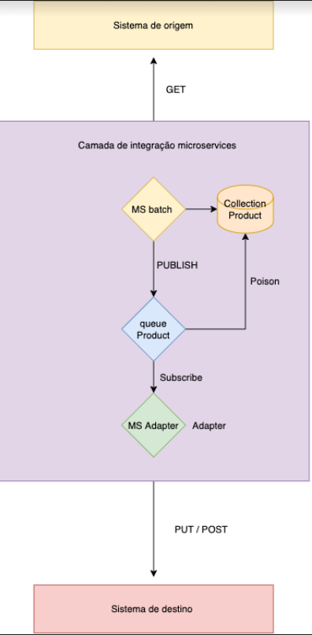

# Tech Eval PortoBello

# Introdução 
   voce faz parte do time de integrações da Portobello e recebeu a demanda de integrar dados de produto que estão sendo originados pelo sistema de origem  e precisam ser inputados no sistema de destino. 
   Sua tarefa é criar uma arquitetura de integração que seja possivel realizar este fluxo com qualidade , escalabilidade e segurança. 

## 1. Objetivo:
        
  * Criar uma API fake ou utilizar alguma api publica que contenha cadastro de produtos. 
  * Criar Uma API fake que exponha um metodo Post para inserção dos dados de produtos consultados no sistema de origem.
  * Desenvolver a solução utilizando microserviços e uma arquitetura orientada a eventos , que tem como objetivo pegar os dados da Api de produto e inserir no sistema de destino. 
        
## 2. Regras Gerais:

  * O desenvolvimento dos microserviços devem ser feitos em java (springboot). 
  * Pode-se utilizar banco no-sql ou h2 para armazenar estado.
  * Para a mensageria você pode utlizar rabbitmq ou kafka.
  * Pode trabalhar com o banco h2 para armazenar as mensagens enviadas.
  * Seu código será avaliado quanto ao cumprimento das tarefas e a qualidade do código escrito.
  * No seu codigo seram avaliados os seguintes criterios:
  
         a. Execução;
         b. Codigo limpo;
         c. Organização;
         d. Legibilidade;
         e. Cobertura de testes;
         f. Tratativa de erros e de exceções;
    
## 3. Arquitetura de Referencia:

Segue abaixo um exemplo de arquitetura que pode ser utilizada como base para o desenvolvimento da integração.

## 4. Exemplos Json: 

Segue abaixo exemplos que podem ser utilizados na api de get e Put. 

    A.  Get products
     $ curl -XGET https://api.produto.exemplo/{code}

     $ curl -XGET https://api.produto.exemplo/7897312400184
    Response:
     {
     Product: {
      code: "7897312400184",
      name: "DETERGENTE ECONOMICO NEUTRO 500ML",
      category: "",
      manufacturer: "",
      id: "9587e780-e495-11e5-9d5b-5da257427e93"
     }
    }

     
     b. Add products
     $ curl -XPOST https://api.produto.exemplo/v1/products \
       -H 'Content-Type: application/json' \
       -d '{"": ""}'
       
       c. Update products
          $ curl -XPUT https://api.produto.exempplo/v1/products/{id} \
        -H 'Content-Type: application/json' \
        -d '{"": "."}'

     d.  Delete products
    $ curl -XDELETE https://api.produto.xyz/v1/products/{id}
  
## 5. Entregaveis:
    Ao final do desenvolvimento voce deve entregar: 
       - Repositorio com o codigo fonte , contendo orientações de como subir o ambiente. 
       - Breve explicação da solução desenvolvida.
